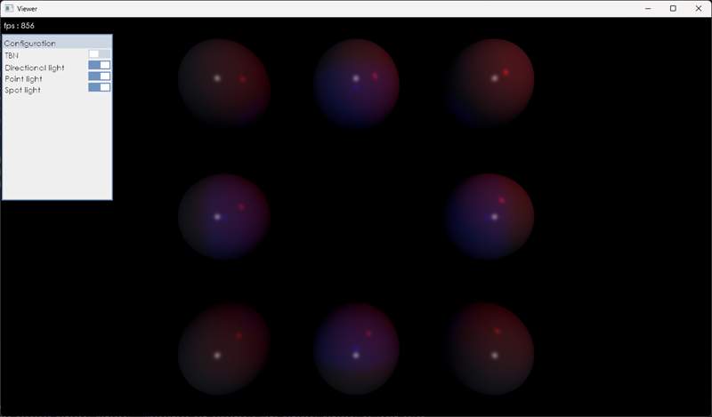
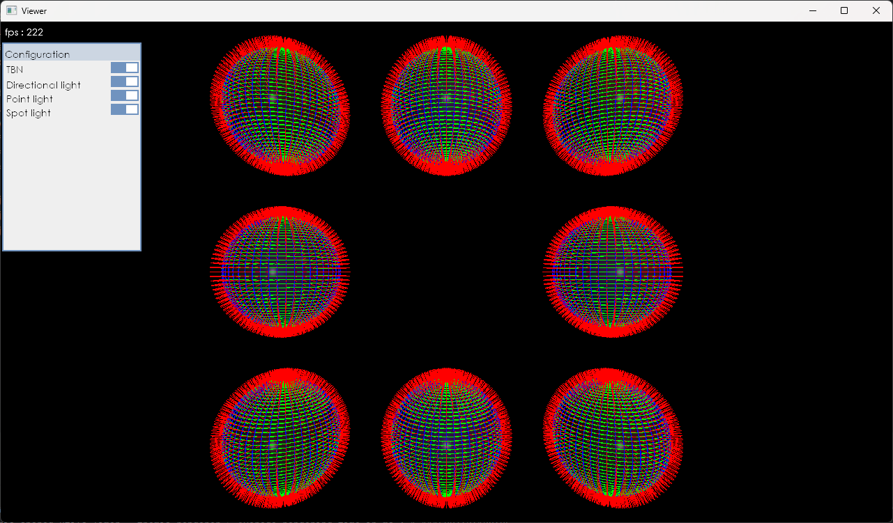
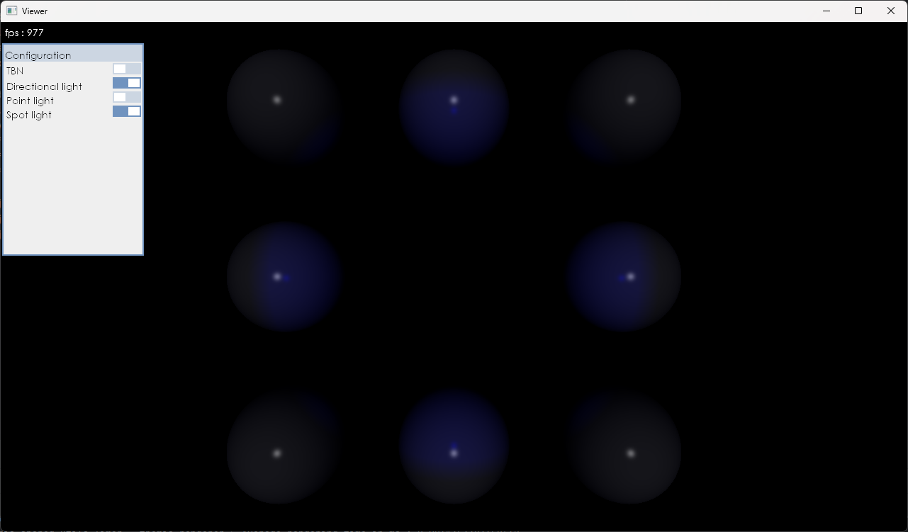
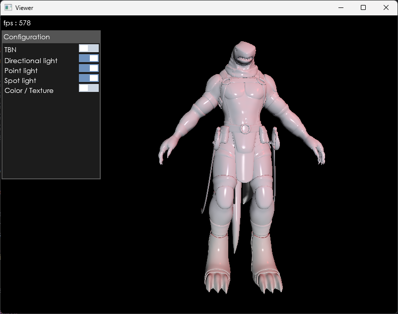
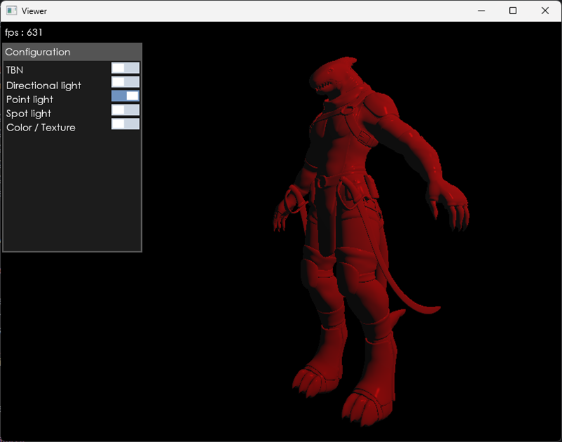
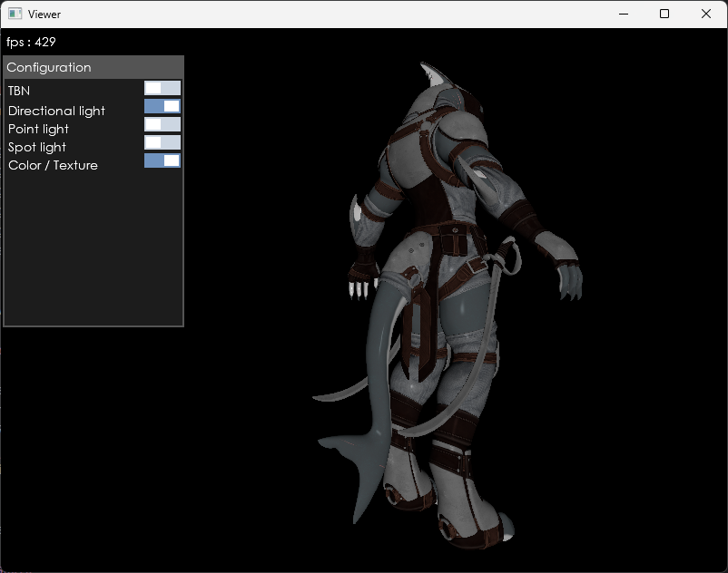

## Description 
Themis is a Vulkan rendering engine written in Java.
The viewer is a sample application built with this engine.

## Features

### ✨ Done

* Renderer
  * Resource loading
    * Model
    * Texture
    * Font (Standard and Signed Distance Field Fonts)
    * Shader source
  * Light casters
    * Directional
    * Point
    * Spot
  * Material
    * Basic color material (Phong lighting)
    * Basic texture material (Phong lighting) + Normal mapping
  * Mouse picking
  * Post processing
    * TBN display
  * Immediate Mode UI
    * Button
    * Toggle button
    * Panel
    * Label
  
* Viewer
  * Sample scene
  * Key mapping
  * User interface
    * Toggle TBN
    * Toggle directional light
    * Toggle point light
    * Toggle spot light
    * Toggle Material (color <-> texture)
  * Mouse control

* Other
  * Native executable building with GraalVM Native Image
 
### 📝 Todo

* Renderer
  * Material
    * PBR material
  * Post processing
    * Grid Display
    
* Viewer
  * Mouse picking

# Screenshots
### Sphere
#### Default view
 

#### With TBN vectors

#### UI Panel & Toggle button
 

### Shark ([The model on https://sketchfab.com/](https://sketchfab.com/3d-models/anthro-shark-6e9d487cbce94dd58a4591fec7aff8f9))
#### Material : color, all light

#### Material : color, point light

#### Material : texture, directional light

 
