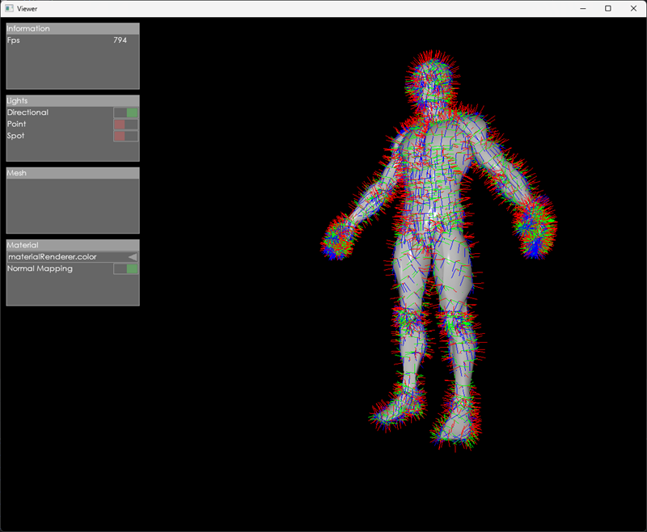
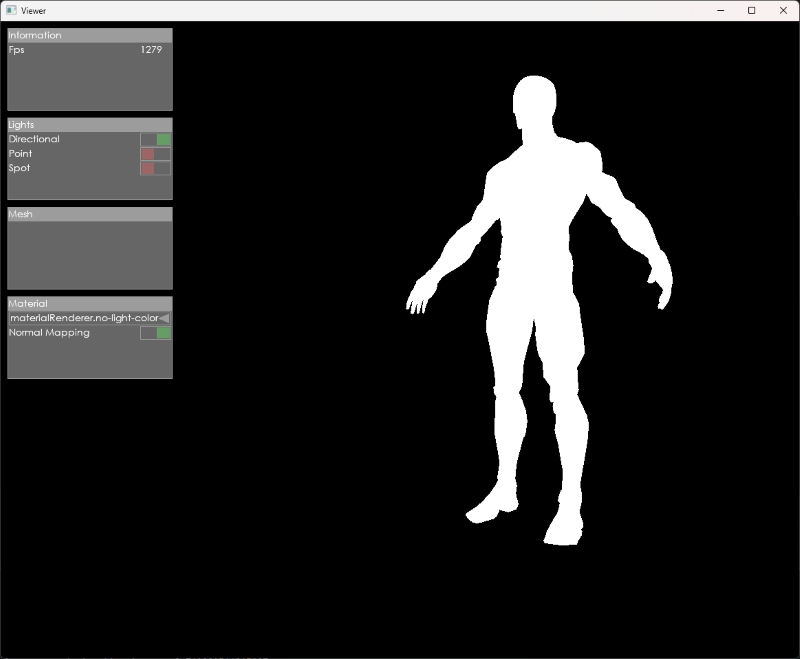
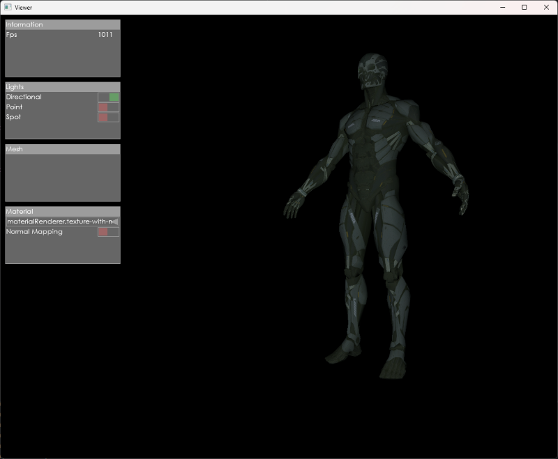
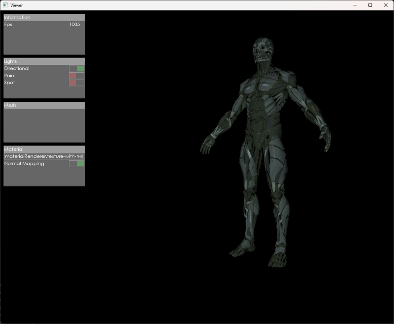
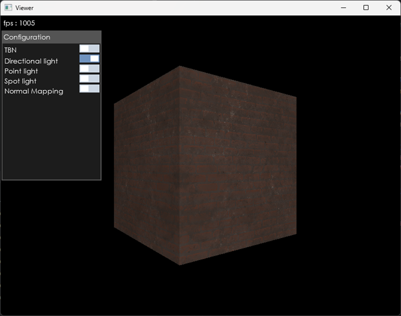
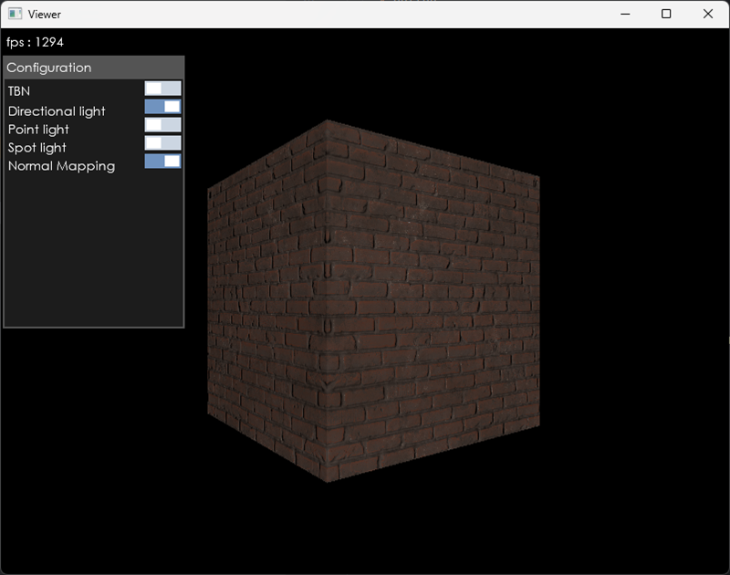

## Description 
Themis is a Vulkan rendering engine written in Java.
The viewer is a sample application built with this engine.

# Screenshots
### Shark (Color material / Texture material)

Model : [https://sketchfab.com/3d-models/anthro-shark-6e9d487cbce94dd58a4591fec7aff8f9](https://sketchfab.com/3d-models/anthro-shark-6e9d487cbce94dd58a4591fec7aff8f9)

### Sed 2.0 With TBN vectors

Model : [https://sketchfab.com/3d-models/sed-2-0-41831eb62be54000b10eb1cf13d4ba39](https://sketchfab.com/3d-models/sed-2-0-41831eb62be54000b10eb1cf13d4ba39)

### Sed 2.0 - Color renderer (No light / Phong)

Model : [https://sketchfab.com/3d-models/sed-2-0-41831eb62be54000b10eb1cf13d4ba39](https://sketchfab.com/3d-models/sed-2-0-41831eb62be54000b10eb1cf13d4ba39)

### Sed 2.0 - Texture renderer (Without normal mapping / With normal mapping)

Model : [https://sketchfab.com/3d-models/sed-2-0-41831eb62be54000b10eb1cf13d4ba39](https://sketchfab.com/3d-models/sed-2-0-41831eb62be54000b10eb1cf13d4ba39)

### Wall (Without normal mapping / With normal mapping)

## Features

* ✨Renderer
  * Resource loading
    * Model
    * Texture
    * Font
    * Shader source
  * Light casters
    * Directional
    * Point
    * Spot
  * Mouse picking
  * Material system
  * Post processing render pass
    * TBN display
  * Immediate Mode UI
    * Button
    * Toggle button
    * Panel
    * Label
    * Combo box

* ✨Viewer
  * Sample scene
  * Key mapping
  * User interface
    * Toggle TBN
    * Toggle directional light
    * Toggle point light
    * Toggle spot light
    * Toggle Normal mapping
  * Mouse control
  * Material renderer
    * Color material renderer (no light)
    * Color material renderer (Phong)
    * Texture material renderer + Normal mapping
  
* ✨Other
  * Native executable building with GraalVM Native Image
