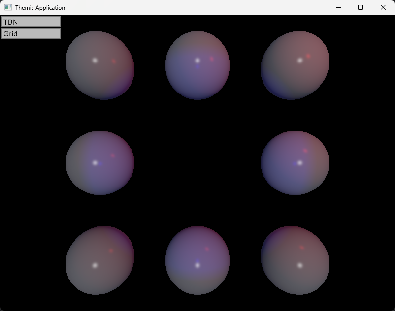
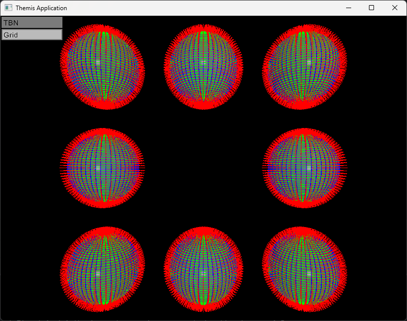
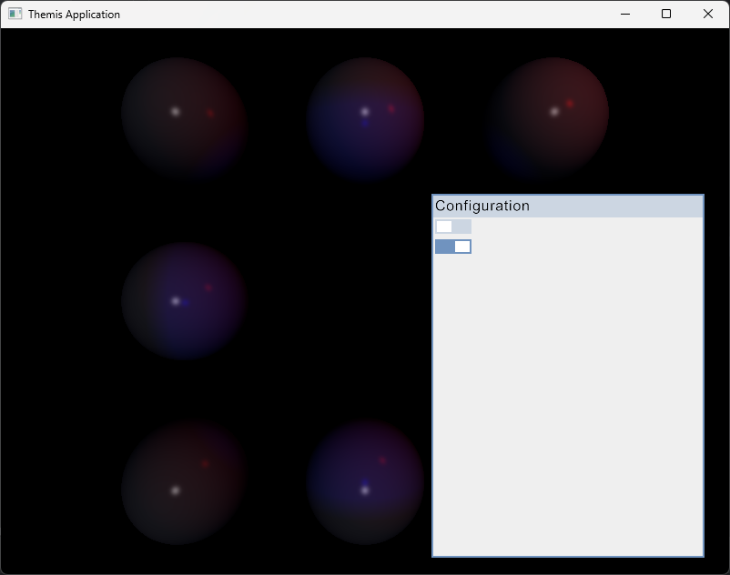

## Description 
Themis is a Vulkan rendering engine written in Java.
The viewer is a sample application built with this engine.

## Features

### ✨ Done

* Renderer
  * Resource loading
    * Model
    * Texture
    * Font
  * Light casters
    * Directional
    * Point
    * Spot
  * Material
    * Basic color material (Phong lighting)
  * Mouse picking
  * Post processing
    * TBN display
  * Immediate Mode UI
    * Button
    * Toggle button
    * Panel

* Viewer
  * Sample scene
  * Key mapping
  * User interface
    * Toggle TBN
 
### 📝 Todo

* Renderer
  * Material
    * Basic texture material (Phong lighting)
    * PBR material
  * Post processing
    * Grid Display
  * Immediate Mode UI
    * Label
    
* Viewer
  * Mouse picking

# Screenshots

* Default view

* With TBN vectors

* UI Panel & Toggle button

 